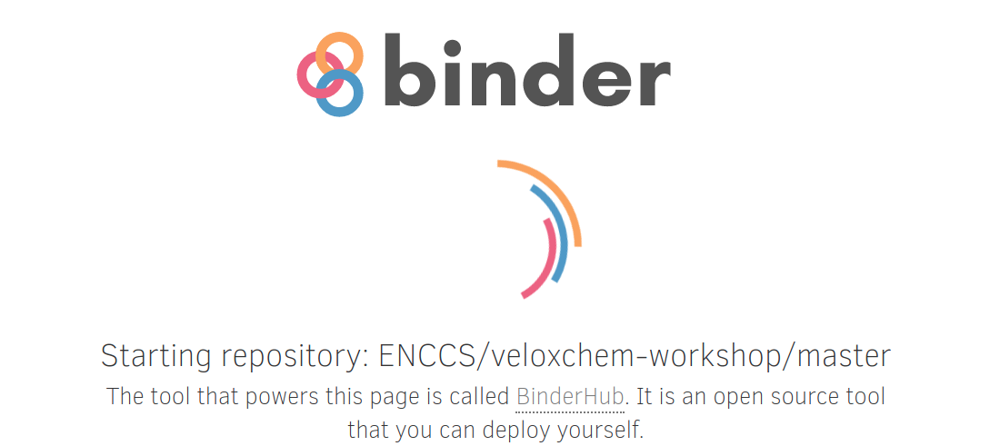
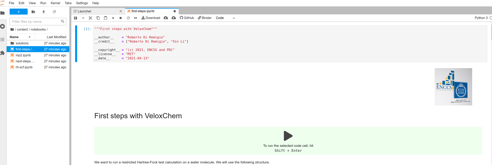
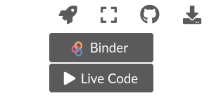

VeloxChem
=========

.. todo::

   Write an intro!!!

.. prereq::

   Before attending this workshop, please make sure that you have the
   prerequisite software and hardware available.

   Day 1
       We will work within `Jupyter notebooks <https://jupyter.org/>`_. We have
       set up this lesson such that it can be run entirely within your browser,
       using cloud infrastructure.
       You can also use your own computer, provided that it has
       the necessary tools installed. If you do not already have these
       installed, we recommend that you set up an isolated software environment
       using ``conda``. Detailed instructions can be found
       on the :doc:`setup` page.

   Day 2
       Access to a supercomputer.
       Any questions on how to use a particular HPC resource should be directed
       to the appropriate support desk. Detailed instructions can be found
       on the :doc:`setup` page.

.. toctree::
   :hidden:
   :maxdepth: 1

   setup

.. toctree::
   :hidden:
   :maxdepth: 1
   :caption: The lesson
   
   notebooks/intro
   notebooks/visualization

.. csv-table::
   :widths: auto
   :delim: ;

   20 min ; :doc:`notebooks/intro`
   20 min ; :doc:`notebooks/visualization`

.. toctree::
   :maxdepth: 1
   :caption: Reference

   quick-reference
   zbibliography
   guide

.. _learner-personas:

Who is the course for?
----------------------

.. todo::

   Write me!!!

About the course
----------------

This lesson material is developed by the `EuroCC National Competence Center
Sweden (ENCCS) <https://enccs.se/>`_ and taught in ENCCS workshops.

It is aimed
at researchers and developers who might have had some exposure to `CMake`_ and
want to learn how to use it effectively. This lesson targets **CMake >=3.14**.

Each lesson episode has clearly defined learning objectives and includes
multiple exercises along with solutions, and is therefore also useful for
self-learning.
The lesson material is licensed under `CC-BY-4.0
<https://creativecommons.org/licenses/by/4.0/>`_ and can be reused in any form
(with appropriate credit) in other courses and workshops.
Instructors who wish to teach this lesson can refer to the :doc:`guide` for
practical advice.

Interacting with the notebooks
^^^^^^^^^^^^^^^^^^^^^^^^^^^^^^

`MyBinder <https://mybinder.org/>`_ offers a free, customizable cloud
computing environment and powers the content of this lesson.
You can run the exercises for Day 1 of this workshop entirely in the
cloud.

The MyBinder web interface
~~~~~~~~~~~~~~~~~~~~~~~~~~

You can access the JupyterLab instance for this workshop by clicking the "launch
binder" button at the top of the ``README`` file displayed at
https://github.com/ENCCS/veloxchem-workshop

.. figure:: img/launch_binder_button.png
   :scale: 70%
   :alt: Launching the binder
   :align: center

This will bring you to the loading page for the binder, which might
take a few minutes to start up. Don't despair!

Once loaded, you will see the introductory notebook already open:

Accessing a terminal
++++++++++++++++++++

From the "Launcher" tab, you can access terminal, Python interpreter, and notebook launchers:

.. figure:: img/launcher_menu.png
   :scale: 50%
   :alt: Launcher menu on Jupyter Lab
   :align: center

You can open a text editor (for input files etc) by clicking "New" and
select Text File. If you prefer a terminal editor, you can use ``nano`` or
``vim`` or ``emacs``.

Starting the notebook from an episode
~~~~~~~~~~~~~~~~~~~~~~~~~~~~~~~~~~~~~

You can run the notebook directly from an episode in the lesson. Click on the
rocket icon on the top right of the page and select which launcher to use:

"Binder" will redirect you the binder instance. With "Live code", you can run
and modify the code cells within the webpage.
The "Live code" option is powered by `sphinx-thebe <https://github.com/executablebooks/sphinx-thebe>`_ and, behind the scenes,
MyBinder. Be aware that you will not be able to add new code cells in a live
session.

See also
--------

There are many free resources online regarding Python and Jupyter:

- The `MolSSI <http://molssi.org/>`_  introductory course on `Python scripting
  for computational molecular science
  <https://education.molssi.org/python_scripting_cms/>`_.
- The `Aalto Scientific Computing <https://scicomp.aalto.fi/>`_ course on `Python for scientific
  computing <https://aaltoscicomp.github.io/python-for-scicomp/>`_.
- The `CodeRefinery <https://coderefinery.org/>`_ course `Introduction to
  Jupyter and JupyterLab <https://coderefinery.github.io/jupyter/>`_

For reference material on quantum chemistry:

- Helgaker, T.; Jørgensen, P.; Olsen, J. *Molecular Electronic-Structure Theory* :cite:`Helgaker2000-yb`
- Szabo, A.; Ostlund, N. S. *Modern Quantum Chemistry: Introduction to Advanced Electronic Structure Theory* :cite:`Szabo1996-vl`

Credits
-------

The lesson file structure and browsing layout is inspired by and derived from
`work <https://github.com/coderefinery/sphinx-lesson>`_ by `CodeRefinery
<https://coderefinery.org/>`_ licensed under the `MIT license
<http://opensource.org/licenses/mit-license.html>`_. We have copied and adapted
most of their license text.

Instructional Material
^^^^^^^^^^^^^^^^^^^^^^

All ENCCS instructional material is made available under the `Creative Commons
Attribution license (CC-BY-4.0)
<https://creativecommons.org/licenses/by/4.0/>`_. The following is a
human-readable summary of (and not a substitute for) the `full legal text of the
CC-BY-4.0 license <https://creativecommons.org/licenses/by/4.0/legalcode>`_.
You are free:

- to **share** - copy and redistribute the material in any medium or format
- to **adapt** - remix, transform, and build upon the material for any purpose,
  even commercially.

The licensor cannot revoke these freedoms as long as you follow these license terms:

- **Attribution** - You must give appropriate credit (mentioning that your work
  is derived from work that is Copyright (c) ENCCS and, where practical, linking
  to `<https://enccs.se>`_), provide a `link to the license
  <https://creativecommons.org/licenses/by/4.0/>`_, and indicate if changes were
  made. You may do so in any reasonable manner, but not in any way that suggests
  the licensor endorses you or your use.
- **No additional restrictions** - You may not apply legal terms or
  technological measures that legally restrict others from doing anything the
  license permits. With the understanding that:

  - You do not have to comply with the license for elements of the material in
    the public domain or where your use is permitted by an applicable exception
    or limitation.
  - No warranties are given. The license may not give you all of the permissions
    necessary for your intended use. For example, other rights such as
    publicity, privacy, or moral rights may limit how you use the material.

Software
^^^^^^^^

Except where otherwise noted, the example programs and other software provided
by ENCCS are made available under the `OSI <http://opensource.org/>`_-approved
`MIT license <http://opensource.org/licenses/mit-license.html>`_.
